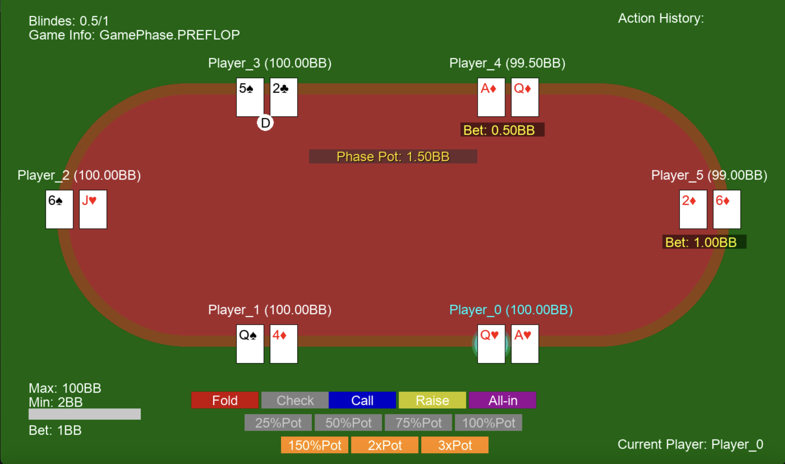
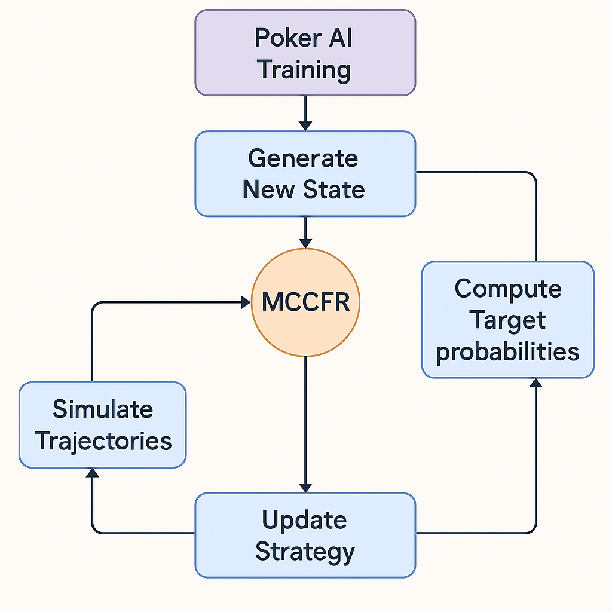
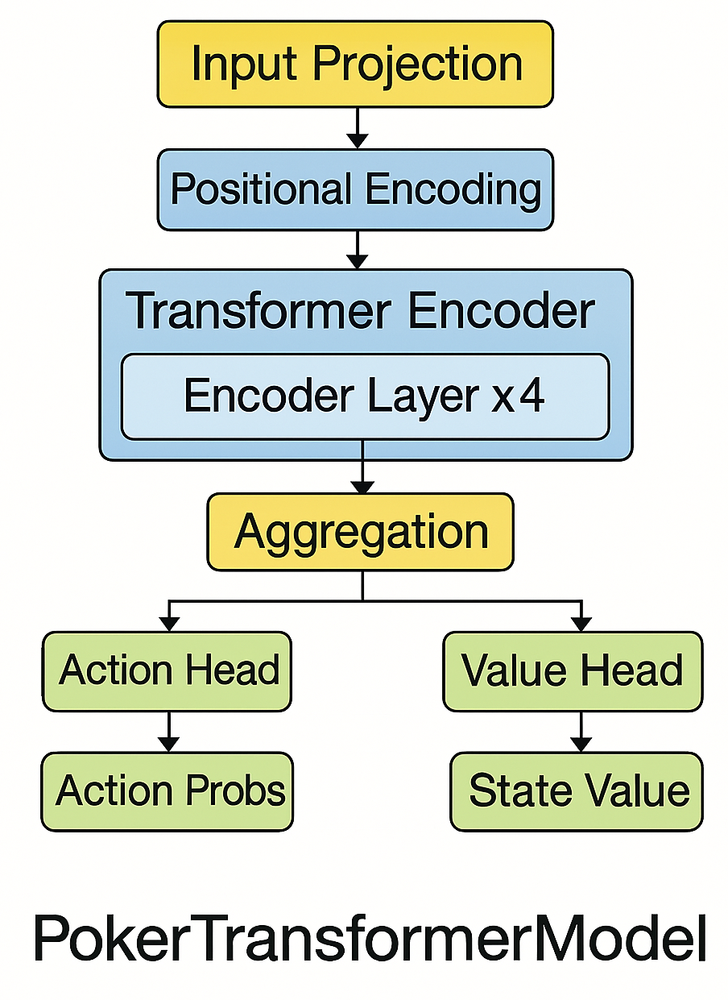

# Deep-Flush: Advanced Poker AI System


Deep-Flush is a high-performance Texas Hold'em No-Limit poker AI system that combines Monte Carlo Counterfactual Regret Minimization (MCCFR) with deep reinforcement learning to achieve state-of-the-art poker play.

## Core Components

### AI Architecture
- State-of-the-art transformer-based neural network
- MCCFR algorithm for optimal strategy computation
- Actor-Critic architecture for policy optimization

### Game Engine
- Full Texas Hold'em No-Limit implementation
- Support for 6-player tables
- Advanced betting system with side pot handling

### Training Infrastructure
- Multi-agent training environment
- Configurable simulation parameters
- Real-time performance tracking
- Model persistence and loading

### Analysis Tools
- Interactive game visualization
- Performance analytics dashboard
- Action probability heatmaps



## Quick Start

### Requirements
```bash
python >= 3.8
pytorch >= 1.7
pygame
numpy
```

### Setup
1. Clone the repository:
```bash
git clone https://github.com/yourusername/poker-ai.git
cd poker-ai
```

2. Install dependencies:
```bash
python3 -m venv poker_env
source poker_env/bin/activate
pip install -r requirements.txt
```

### Usage
Training mode:
```bash
clear
source poker_env/bin/activate
python main.py
```

Visualization mode:
```bash
python main.py --rendering True
```

## Configuration

Key parameters in `utils/config.py`:
```python
EPISODES = 5_000        # Training episodes
GAMMA = 0.9985         # Discount factor
ALPHA = 0.001          # Learning rate
MC_SIMULATIONS = 25    # MCCFR iterations
```

## Technical Details

### State Space
The system uses a 142-dimensional state vector comprising:
- Player cards (10D)
- Community cards (25D)
- Hand strength metrics (12D)
- Game state information (5D)
- Stack sizes and positions (6D)
- Additional game context

### Neural Architecture


1. **State Embedding**
   - 142D → 64D projection layer

2. **Transformer Core**
   - Multi-head self-attention
   - Position-wise feed-forward networks

3. **Output Layer**
   - Policy head: action probabilities
   - Value head: state value estimation

## Performance Metrics

The system excels in:
- Strategic decision-making
- Pot odds calculation
- Position-based strategy
- Hand strength evaluation


## Development Guide

### Agent Implementation
```python
agent = PokerAgent(
    state_size=STATE_SIZE,
    device=device,
    action_size=12,
    gamma=GAMMA,
    learning_rate=ALPHA,
    load_model=False
)
```

### Model Sharing
```python
shared_model = agent_list[0].model
for agent in agent_list:
    agent.model = shared_model
```

## Citation

For academic use:
```bibtex
@software{poker_ai_2024,
  author = {Eliott Valette and Mathias Garcia},
  title = {Poker AI Training System},
  year = {2025},
  publisher = {GitHub},
  url = {https://github.com/eliottvalette/DeepFlush.git}
}
```

## Credits

- OpenAI's transformer architecture
- DeepMind's MCCFR implementation
- Poker AI research community